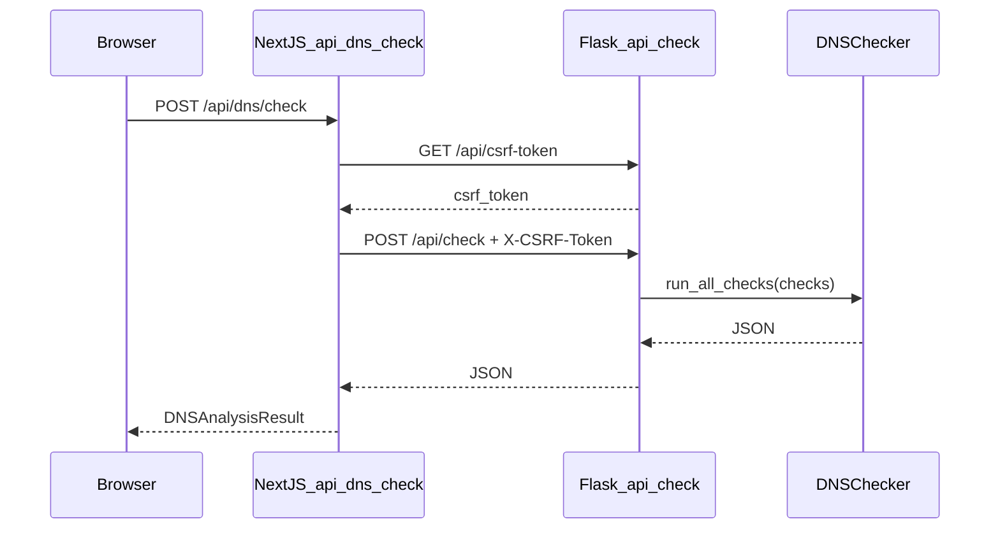
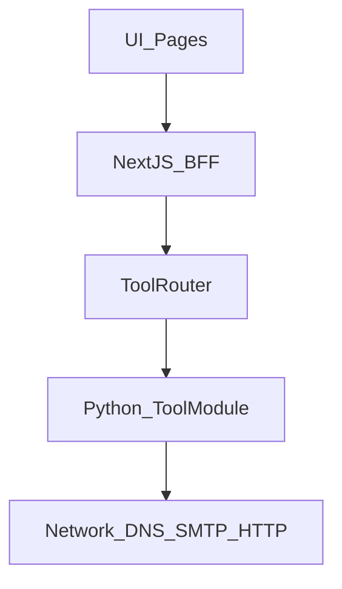

# DNSBunch Architecture

**Status:** Authoritative architecture document (boundaries and behavior classes-not the HTTP endpoint catalog).  
**Scope:** What exists today vs what is planned; layer rules; invariants.  
**Endpoint details:** [API.md](API.md)  
**last_verified_against_repo:** 2026-09-15

---

## Component matrix (Today vs Planned)

| Component | Today | Planned | Rule |
|-----------|-------|---------|------|
| Next.js | Yes | Yes | Product UI + BFF only |
| Flask | Yes | Yes (transition) | Current Python HTTP API |
| DNSChecker | Yes | Yes | **Single DNS health engine** |
| Bulk orchestration | No | Yes | **Must reuse DNSChecker** (orchestration only) |
| Tool registry | No | Yes | Shared tool dispatch |
| Internal JWT | No | Yes | Server-to-server only |
| PostgreSQL | No | Yes | Only when persistent state is needed |
| Auth | No | Optional | **Never required for public lookup** |
| Stripe | No | Yes | Only after a paid experiment |
| Mail inbound SMTP | No | Yes | **Separate service/process** |
| Redis | No | Later | When scale requires shared limits/state |
| Job queue | No | Later | Large async bulk jobs only |

---

## Architecture invariants

| ID | Invariant |
|----|-----------|
| **INV-1** | Full DNS health analysis is performed only by `DNSChecker.run_all_checks()` in [backend/dns_checker.py](../backend/dns_checker.py). |
| **INV-2** | Bulk DNS health is orchestration + presentation only; **no second** NS/MX/SOA/WWW engine. |
| **INV-3** | Browsers use Next.js BFF routes; **new tools must not** call Flask directly from the client. |
| **INV-4** | HTTP/website tools (planned) must enforce SSRF controls before fetching URLs. |
| **INV-5** | [API.md](API.md) owns endpoints, request/response schemas; this document owns **boundaries** and **behavior classes**. |

---

## 1. Architecture principles

- **Slow growth:** Extend a working DNS health product into a toolbox over time; no big-bang paid launch.
- **Free public lookups:** Basic diagnostics stay available without login ([PRODUCT_STRATEGY.md](PRODUCT_STRATEGY.md)).
- **Reuse:** One engine for single, bulk, and future API surfaces for DNS health.
- **Evidence-driven Pro:** Billing features follow metrics, not assumptions.
- **Separation:** Next.js = product; Python = network/diagnostics; PostgreSQL = persistence when needed.

---

## 2. Current production architecture [CURRENT]

```text
User Browser
     │
     ▼
Netlify (Next.js 15)
     │  SSR/UI + /api/* BFF
     ▼
Render / VPS (Flask + gunicorn)
     │  /api/check, /api/csrf-token
     ▼
DNSChecker (dnspython, asyncio)
     │
     ▼
Public DNS / SMTP (Internet)
```

No database, queue, or inbound mail in production today.

---

## 3. Current DNS Health request flow [CURRENT]



**References:** [frontend/src/app/api/dns/check/route.ts](../frontend/src/app/api/dns/check/route.ts), [backend/app.py](../backend/app.py) `check_dns()`, [frontend/src/hooks/useDNSAnalysis.ts](../frontend/src/hooks/useDNSAnalysis.ts).

---

## 4. Current repository structure [CURRENT]

```text
DNSBunch/
  frontend/src/          Next.js app, components, BFF routes
  backend/
    app.py               Flask routes, security middleware
    dns_checker.py       DNS health engine (monolith)
    data/                TLD data for checks
  docs/                  Documentation (this file, API.md, features/)
```

There is **no** `backend/tools/` package in the repo today (planned).

---

## 5. Current deployment [CURRENT]

| Piece | Target | Notes |
|-------|--------|--------|
| Frontend | Netlify | [frontend/netlify.toml](../frontend/netlify.toml), Next plugin |
| Backend | Render (example) | [backend/render.yaml](../backend/render.yaml), `gunicorn app:app`, health `GET /` |

Production pairs a public Next origin with a separate Flask API URL via `BACKEND_URL` on Netlify.

---

## 6. Current security model [CURRENT]

### CSRF (Flask `POST /api/check`)

- Token from `GET /api/csrf-token` ([app.py](../backend/app.py)).
- JWT (`JWT_SECRET_KEY`), bound to hashed client IP + User-Agent.
- Default expiry: `CSRF_TOKEN_EXPIRES` = **3600 s** (1 hour).
- Required header: `X-CSRF-Token`.

### Rate limiting

- Default: **50** requests per **300** seconds per IP (`RATE_LIMIT_REQUESTS`, `RATE_LIMIT_WINDOW`).
- On exceed: HTTP **429**, IP blocked for **`BLOCK_DURATION`** default **60 seconds** (not 1 hour).
- Headers: `X-RateLimit-Remaining`, `X-RateLimit-Reset` on responses when limiter runs (no `X-RateLimit-Limit` in code).

### CORS

- Flask-CORS allowlist (production domains + localhost dev ports in code).
- `supports_credentials=True` for credentialed flows.
- `ALLOWED_ORIGINS` env overrides default production origin list.

### Origin validation (POST)

- If `Origin` header present, must be in `ALLOWED_ORIGINS` ([validate_request](../backend/app.py)).

### Client IP (trusted proxy)

- `get_client_ip()`: first hop of `X-Forwarded-For`, else `X-Real-IP`, else `remote_addr`.
- **Gap [PLANNED]:** document trusted proxy list; spoofing risk if Flask is exposed without Netlify/Render setting forwarded headers only.

### Domain input validation

- Max length 253; regex validation; blocks patterns including `localhost`, `127.0.0.1`, `test.test`, `example.example` ([is_valid_domain](../backend/app.py)).

### Response security headers

- `X-Content-Type-Options`, `X-Frame-Options`, `X-XSS-Protection`, `Referrer-Policy` ([after_request](../backend/app.py)).

### Secret management [CURRENT + PLANNED]

- **Today:** `CSRF_SECRET_KEY`, `JWT_SECRET_KEY` from env or auto-generated at process start (ephemeral if unset-bad for multi-instance).
- **Planned:** Required secrets in deployment env; never commit; rotate procedure documented in runbooks.

### Not implemented today [PLANNED]

- Internal API JWT, SSRF gate, inbound mail abuse controls, Redis-backed rate limits, request ID propagation.

Full HTTP error codes: [API.md](API.md).

---

## 7. Current configuration [CURRENT]

See **§29 Environment variables (CURRENT)**. Code wins over stale `.env.example` keys (e.g. `RATE_LIMIT` in example is unused; app uses `RATE_LIMIT_REQUESTS`).

---

## 8. DNS Health engine architecture [CURRENT]

**Entry point:**

```python
checker = DNSChecker(domain)
await checker.run_all_checks(requested_checks=None)
```

Flask uses `asyncio.run(...)` inside [check_dns()](../backend/app.py).

### Resolver timeouts

- Per [DNSChecker.__init__](../backend/dns_checker.py): `timeout=10`, `lifetime=30` (seconds).

### Top-level categories (`all_check_types`)

`domain_status`, `ns`, `soa`, `a`, `aaaa`, `mx`, `spf`, `txt`, `cname`, `ptr`, `caa`, `dmarc`, `dkim`, `glue`, `dnssec`, `axfr`, `wildcard`, `www`

- If `checks` omitted or empty → all categories run.
- Unknown `checks` values are filtered out.
- Parent delegation lives **inside** `ns`, not a separate top-level key.

### Per-category failure

- Exception in one category → that key gets `status: error` with issue message; other categories still run ([run_all_checks](../backend/dns_checker.py) loop).

### Summary object

- Counts categories by top-level `status`: pass, warning, error, info.

Record semantics: [DNS_RECORDS.md](DNS_RECORDS.md). Feature-level doc: [features/shipped/dns-health-single.md](features/shipped/dns-health-single.md).

---

## 9. Bulk architecture [PLANNED]

Bulk is **not shipped**. Design is normative for implementation:

```text
DNSChecker.run_all_checks()     ← INV-1 / INV-2
         │
 analyze_domain(domain)        ← thin async wrapper
         │
 bulk_analyze(domains, sem=N)   ← asyncio.Semaphore
         │
 rollup_for_bulk(result)        ← no network I/O
         │
 Table / CSV / drill-down UI    ← reuse single-domain results components
```

| Topic | Rule |
|--------|------|
| Engine | Same as single domain (INV-1, INV-2) |
| Concurrency | Bounded (e.g. 10–50); never unbounded parallel loops |
| Partial failure | Per-domain error row; job continues for other domains |
| tool_id | `dns_health` with `surface: bulk` (ADR-001)-not a separate product tool_id |
| Transport | Next BFF → Python orchestration endpoint (future) |
| Product phases | Bulk **1–3** → [Phase 1](roadmap/PHASES.md#phase-1-free-diagnostic-expansion); Bulk **4** (queues, job IDs) → [Phase 4](roadmap/PHASES.md#phase-4-scale--advanced) |

Detail: [features/dns-health/bulk-checker.md](features/dns-health/bulk-checker.md).

---

## 10. Future tool platform [PLANNED]

- **`tool_id`:** stable snake_case identifier per user-facing tool (catalog in [TOOL_PLUGIN_CONTRACT.md](TOOL_PLUGIN_CONTRACT.md)).
- **Registry:** Python maps `tool_id` → runner; Next maps route → `tool_id`.
- **DNS health:** `tool_id = dns_health`; surfaces: `single` (shipped), `bulk`, `api` (planned).

---

## 11. Tool execution contract [CURRENT + PLANNED]



| Layer | Allowed | Forbidden |
|--------|---------|-----------|
| **UI** | Display, client-side validation, SEO | Secrets, raw Flask URL for new tools, DNS sockets |
| **Next BFF** | Proxy, timeouts, quotas, analytics, SSRF gate (planned), internal JWT to Python | Reimplement diagnostics in TypeScript |
| **Tool router** (planned) | Dispatch by `tool_id`, enforce timeouts | Duplicate business logic |
| **Python tool** | DNS/SMTP/HTTP fetch, engines | Stripe webhooks, long-lived user sessions |
| **PostgreSQL** (planned) | Accounts, jobs, mail sessions, aggregates | Default storage of anonymous queried domains |

**Today:** UI → BFF (`/api/dns/check`) → Flask → DNSChecker only.

---

## 12. Next.js BFF architecture [CURRENT + PLANNED]

**Today**

- Client [api.ts](../frontend/src/services/api.ts): `POST /api/dns/check` (same origin).
- BFF fetches CSRF, forwards POST with `User-Agent`, `X-Forwarded-For`.
- Default client timeout: `NEXT_PUBLIC_API_TIMEOUT` = 30000 ms.
- Health proxy: [frontend/src/app/api/health/route.ts](../frontend/src/app/api/health/route.ts) → Flask `GET /`.

**Planned**

- Generic `/api/tools/[toolId]`, entitlement check, internal JWT, request ID.

Stack (verified [frontend/package.json](../frontend/package.json)): Next ^15.4.7, React ^19.1.1, MUI ^7.3.1.

---

## 13. Python service architecture [CURRENT + PLANNED]

**Today:** Single Flask app ([app.py](../backend/app.py)), synchronous WSGI entry, `asyncio.run` per DNS request.

**Planned:** Optional FastAPI layer for OpenAPI; tool modules; keep engines importable unchanged.

---

## 14. Internal authentication [PLANNED]

- Shared secret or signed JWT (`INTERNAL_API_SECRET`) on `/internal/v1/*`.
- Only Next.js (or trusted workers) hold the secret.
- No browser CORS on internal routes.

---

## 15. Optional accounts [PLANNED]

- Auth in Next.js (NextAuth/Clerk) + PostgreSQL.
- **Invariant:** Public DNS health works with no account (component matrix).

---

## 16. Database architecture [CURRENT + PLANNED]

| Data | Today | Planned store | Retention (planned) |
|------|-------|---------------|---------------------|
| DNS lookup query/result | Not persisted | Optional user history | User-controlled / TTL |
| Anonymous analytics | Not persisted | Daily aggregates by tool_id | No domain names in v1 aggregates |
| Mail test sessions | - | PostgreSQL + blob/R2 | Short TTL (e.g. 7 days) |
| Monitoring watches | - | PostgreSQL | Until user deletes |
| Bulk jobs (large) | - | Job table + object storage | TTL |

**Today:** No PostgreSQL in repo for DNS health.

---

## 17. Analytics architecture [PLANNED]

- Events: `tool_view`, `tool_run`, `tool_error` with `tool_id`, optional `surface`, duration, success-see [roadmap/METRICS_DASHBOARD.md](roadmap/METRICS_DASHBOARD.md).
- Default: no per-domain logging for anonymous users in aggregate tables.

---

## 18. Billing and entitlements [PLANNED]

- Stripe webhooks and plans in Next.js only.
- `canRun(user, toolId)` before proxying to Python.
- Activated only after metrics justify a paid experiment.

---

## 19. Mail Tester architecture [PLANNED]

Separate from Flask `/api/check`:

```text
Internet SMTP
      ↓
Inbound SMTP service (dedicated process)
      ↓
RCPT TO → session validation (PostgreSQL/Redis)
      ↓
Message store (.eml, TTL)
      ↓
Scoring worker (SPF/DKIM/DMARC/spam)
      ↓
Next.js poll / results UI
```

Not “just another Flask route.” Detail: [features/email/mail-tester-inbound.md](features/email/mail-tester-inbound.md).

---

## 20. HTTP / website tool security [PLANNED]

For SSL inspector, HTTP headers, redirect chain, HTTP status:

- Block private/reserved/link-local IPs and localhost targets (SSRF).
- Allowlist or strict URL parse; max redirects; short timeouts.
- Rate limit per IP; no raw passthrough of arbitrary URLs without validation.

---

## 21. Monitoring architecture [PLANNED]

- Scheduler (cron/worker) re-runs checks; diff against last snapshot; notify user.
- Uses same DNS health engine for DNS watches (INV-1).
- Requires PostgreSQL + accounts.

---

## 22. Scaling strategy [PLANNED]

| Stage | Approach |
|-------|----------|
| Today | Single Flask instance; in-memory rate limit + CSRF token store |
| Next | Redis for rate limits and CSRF if multi-instance |
| Bulk at scale | Job queue, worker pool, concurrency caps |
| Mail inbound | Dedicated VPS/small service (Render free tier insufficient) |

---

## 23. Failure and timeout handling [CURRENT + PLANNED]

| Scenario | Behavior today | Planned |
|----------|----------------|---------|
| DNS query timeout | Resolver 10s / lifetime 30s | Same; surface in check message |
| Single category exception | Category `error`; others continue | Same |
| Invalid domain | 400 from Flask | Same |
| CSRF invalid/missing | 403 | Same |
| Rate limit | 429 + temporary IP block (60s default) | Redis-backed limits |
| Flask analysis exception | 500 generic error | Structured error + request ID |
| Next BFF cannot reach Flask | 500 `PROXY_ERROR` from route | Retry guidance, health degradation |
| Next client timeout | Axios timeout (30s default) | User message |
| Bulk domain failure | N/A | Row error; job continues |
| Python down | Health check fails | [CURRENT] Next `/api/health` returns 500 |
| SMTP (mail tester) | N/A | Timeouts; reject invalid RCPT |

---

## 24. Observability [CURRENT + PLANNED]

**Today**

- Flask `GET /` health JSON ([health_check](../backend/app.py)).
- Next `GET /api/health` proxies backend health.
- Console logging in engine (`print` in dns_checker)-not structured.

**Planned**

- Request ID (BFF → Flask).
- Structured logs: tool_id, surface, duration_ms, outcome.
- Bulk job metrics; error rates per tool.

---

## 25. Data privacy and retention [CURRENT + PLANNED]

**Today:** No server-side storage of queried domains for anonymous health checks (README claim); logs may still contain domains in stdout-operational caveat.

**Planned:** Privacy policy updates when accounts, analytics, mail storage, or share links ship; explicit retention TTLs (§16).

---

## 26. Abuse prevention [CURRENT + PLANNED]

**Today:** Rate limit, domain blocklist patterns, CSRF on POST check.

**Planned:** Bulk domain caps, mail session RCPT validation, SSRF rules, internal auth, optional CAPTCHA under attack.

---

## 27. Architecture invariants (canonical)

See table at top: **INV-1** through **INV-5**.

---

## 28. Current vs planned components (narrative)

Production path is **Netlify Next → Flask → DNSChecker**. Everything in the component matrix marked “No” or “Later” must not be documented as shipped. Feature specs use `status: planned` unless code exists.

---

## 29. Environment variables

### CURRENT (verified in code)

| Variable | Service | Purpose |
|----------|---------|---------|
| `BACKEND_URL` | Next (server) | Upstream Flask URL |
| `NEXT_PUBLIC_API_URL` | Next (client) | API base, default `/api` |
| `NEXT_PUBLIC_API_TIMEOUT` | Next (client) | ms, default 30000 |
| `RATE_LIMIT_REQUESTS` | Flask | Default 50 |
| `RATE_LIMIT_WINDOW` | Flask | Default 300 (seconds) |
| `BLOCK_DURATION` | Flask | Default 60 (seconds) |
| `CSRF_SECRET_KEY` | Flask | Signing |
| `JWT_SECRET_KEY` | Flask | CSRF JWT |
| `CSRF_TOKEN_EXPIRES` | Flask | Default 3600 |
| `CSRF_REFRESH_THRESHOLD` | Flask | Default 1800 |
| `CORS_ORIGINS` | Flask | Comma-separated |
| `FLASK_ENV`, `FLASK_DEBUG`, `PORT` | Flask | Server |

Note: [backend/.env.example](../backend/.env.example) lists `RATE_LIMIT=60` and `DNS_TIMEOUT`-**not read by app.py** for rate limiting; engine uses hardcoded resolver timeouts in `dns_checker.py`.

### PLANNED (do not assume deployed)

`DATABASE_URL`, `INTERNAL_API_SECRET`, `STRIPE_*`, `REDIS_URL`, `NEXTAUTH_*`, inbound mail secrets, object storage keys.

---

## 30. Deployment evolution

**Current**

```text
Netlify → Next.js BFF → Render Flask → Internet DNS
```

**Future**

```text
Netlify → Next.js BFF → Python Tool API (Flask/FastAPI)
                              ├── DNSChecker / tools
                              └── (no inbound SMTP here)

Mail Tester: separate SMTP ingress → workers → PostgreSQL → Next.js
```

---

## 31. Repository references

| Doc | Purpose |
|-----|---------|
| [API.md](API.md) | HTTP endpoints and payloads |
| [DNS_RECORDS.md](DNS_RECORDS.md) | Record/check descriptions |
| [features/shipped/dns-health-single.md](features/shipped/dns-health-single.md) | Shipped DNS health feature |
| [features/dns-health/bulk-checker.md](features/dns-health/bulk-checker.md) | Planned bulk |
| [TOOL_PLUGIN_CONTRACT.md](TOOL_PLUGIN_CONTRACT.md) | Tool IDs and plugin shape |
| [PRODUCT_STRATEGY.md](PRODUCT_STRATEGY.md) | Product rules |
| [README.md](README.md) | Feature index |

---

## 32. Architecture decision records (ADRs)

### ADR-001: DNS health bulk is a surface, not a separate tool_id

- **Decision:** `tool_id` remains `dns_health`. Bulk and API are **`surface`** values: `single` | `bulk` | `api`.
- **Rationale:** One engine, one product; analytics and entitlements stay coherent.
- **Consequence:** Event schema `{ tool_id: "dns_health", surface: "bulk" }`; no `dns_health_bulk` tool_id.

### ADR-002: SSRF controls for HTTP-based tools

- **Decision:** Before any server-side HTTP fetch, validate URL, block private/internal targets, cap redirects and timeouts.
- **Rationale:** Prevent DNSBunch from becoming an open proxy.
- **Status:** Planned; required before shipping SSL/headers/redirect/status tools.

### ADR-003: API.md vs ARCHITECTURE.md ownership

- **Decision:** API.md is canonical for endpoints and JSON examples; ARCHITECTURE.md is canonical for layers, invariants, CURRENT vs PLANNED, security behavior classes, deployment, and failure modes.
- **Rationale:** Avoid duplicate/conflicting endpoint docs inside architecture.
- **Consequence:** Feature docs link to both; security numbers must match code (e.g. block duration 60s).
